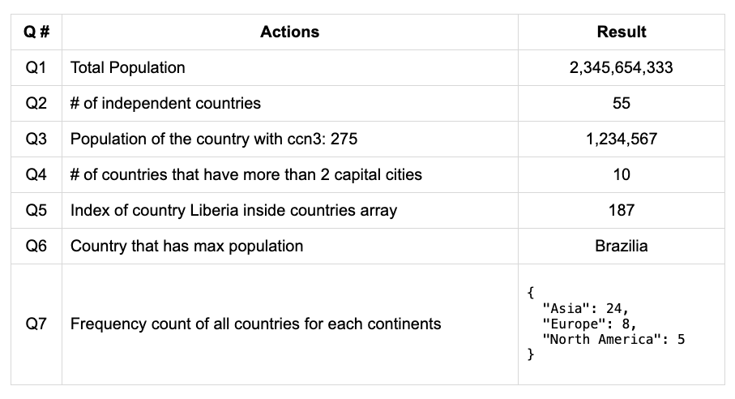

## Answer to the following questions and display the result in the UI

Q1 - Total Population - Number  
Q2 - # of independent countries - Number  
Q3 - Population of the country with ccn3: 275 - Number  
Q4 - # of countries that have more than 2 capital cities - Number  
Q5 - Index of country Liberia inside countries array - Number  
Q6 - Country that has max Population - Name  
Q7 - Frequency count of all countries for each continents - Object

## Sample output with fake data



## Tip to display the result for question 7:

```js
- First get the column location (td) that this object needs to be displayed

const q7 = document.querySelector("#q7 td:last-child");

- In order to display the following obj in the UI:

const obj = {
 Asia: 24,
 Europe: 8,
 "North America": 5,
};

- We need to wrap the JSON stringified text inside <pre> html tag. See for sample output in the README.md file:

q7.innerHTML = `<pre>${JSON.stringify(obj, null, 2)}</pre>`;

```
